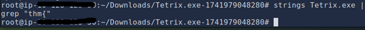
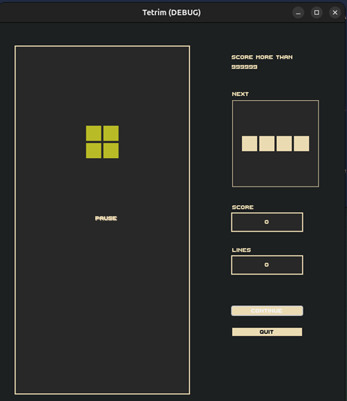
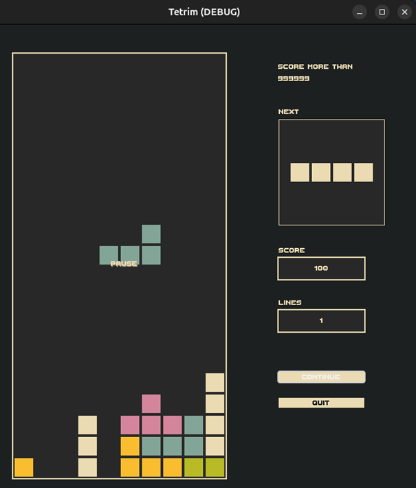
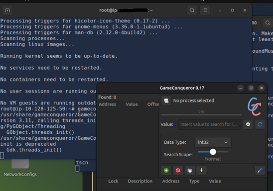
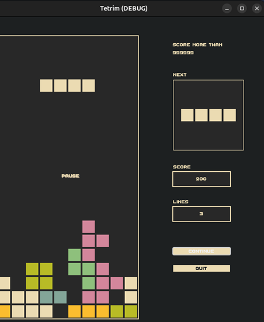
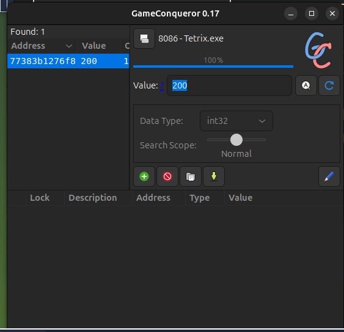
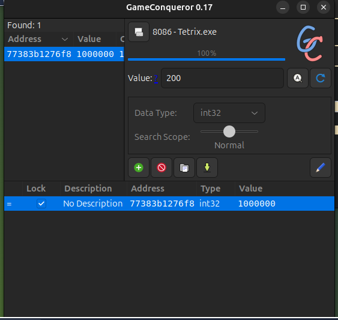
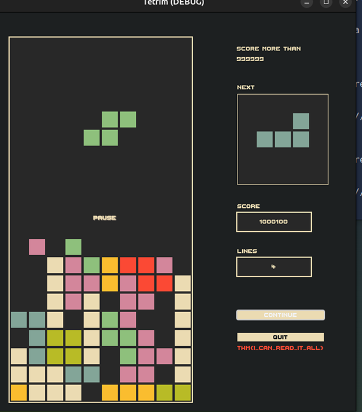

**📝 Writeup : The Game - TryHackMe (Game Hacking)**

**Introduction**

Bienvenue dans ce writeup dédié à la room **"The Game"** de TryHackMe. Pour mon premier challenge de Game Hacking, j'ai dû m'attaquer à une version revisitée du célèbre jeu _Tetris_.

L'objectif était simple en apparence, mais pas facile en pratique : **dépasser un score de 999 999** pour débloquer le flag secret caché par l'utilisateur "Cipher".

**Challenge :** Hacker la logique du jeu pour manipuler les données en mémoire et valider les conditions de victoire sans passer des heures à empiler des blocs.

**Stack Technique & Outils**

Pour mener à bien cette mission depuis mon environnement Linux (AttackBox), j'ai utilisé les outils suivants :

- **Wine** : Indispensable pour exécuter le binaire Windows (tetrix.exe) sur un système Linux.
- **GameConqueror** : Cet outil a été très pratique pour l'analyse dynamique. C'est l'équivalent de _Cheat Engine_ sous Linux, permettant de scanner et de modifier la RAM en temps réel.
- **Terminal Linux** : Pour l'analyse initiale et l'exécution du programme.

**Objectif du Hack**

Le jeu impose une limite de score quasiment inatteignable de manière conventionnelle. Ma stratégie a été d'utiliser la technique du **"Memory Scanning & Filtering"** (terme que j'ai appris car je ne connaissais pas cela avant) :

- Identifier l'adresse mémoire exacte où est stockée la variable score.
- Intercepter cette valeur et la modifier manuellement.
- "Geler" la mémoire pour forcer le jeu à accepter mon nouveau score.

**Solutions**

Commençons par extraire les chaînes de caractères (strings) du fichier .exe pour identifier d'éventuels secrets ou drapeaux exposés directement dans le code compilé.

Le binaire cible étant un exécutable Windows, j'ai utilisé Wine comme couche de compatibilité pour assurer son exécution sur l'AttackBox Linux. Le lancement du programme a été effectué via la commande suivante : wine Tetrix.exe

L'atteinte de l'objectif par les mécanismes de jeu classiques s'avérant irréaliste au vu du temps nécessaire, j'ai décidé de contourner la logique du programme en identifiant l'adresse mémoire associée au score.

Pour mener à bien cette analyse dynamique, j'ai sélectionné GameConqueror.

L'objectif étant d'isoler une valeur en mémoire, j'ai fixé mon score à **200**. Cette valeur arbitraire sert de point d'ancrage pour la première itération du scanner de mémoire de GameConqueror.

Une fois l'adresse mémoire isolée, j'ai procédé à une injection de valeur en remplaçant l'entrée actuelle par 1 000 000. Cette manipulation permet de franchir le seuil de validation de 999 999 points défini par les développeurs et de déclencher la condition de victoire.

Afin de valider le nouveau score, il a fallu provoquer un événement d'écriture au sein du programme. Le fait de compléter une ligne a forcé le binaire à recalculer l'état de la partie, prenant alors en compte le dépassement du seuil critique de 999 999 points.

**Conclusion**

La résolution de la room "The Game" démontre l'efficacité du Memory Hacking face à des mécanismes de protection basés sur des scores arbitraires. En contournant la logique de jeu par une injection directe dans la pile mémoire, le temps d'obtention du flag a été réduit de plusieurs heures à quelques minutes.

Le succès de cette opération repose sur la précision du filtrage des adresses mémoires, une compétence transférable au Reverse Engineering et à l'analyse de malwares.
